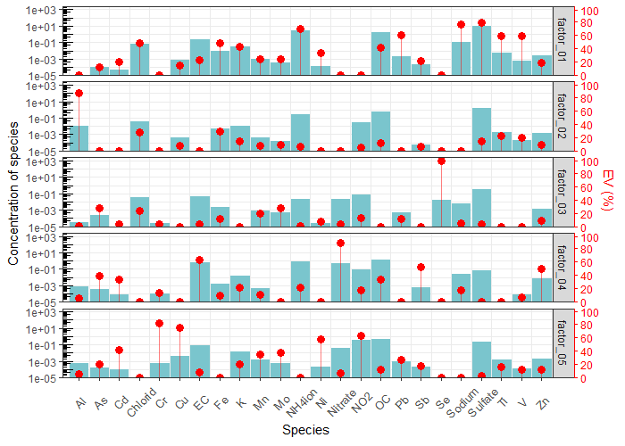
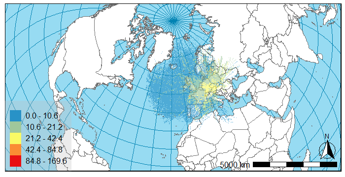

# **me2tools** <a href='https://github.com/rivm-syso/me2tools'></a>

[](https://github.com/rivm-syso/me2tools/actions/workflows/R-CMD-check.yaml)
[](https://lifecycle.r-lib.org/articles/stages.html)

## Introduction

**me2tools** is an R package developed for the processing of the outputs of the Multilinear Engine version 2 (ME-2) and [**MetCor**](https://github.com/ankitrasto/metcor).
A license of the Multilinear Engine can be obtained from Dr. P. Paatero or the ME-2 version provided with the 
[**Positive Matrix Factorization Model for Environmental Data Analyses (EPA-PMF version 5.0)**](https://www.epa.gov/air-research/positive-matrix-factorization-model-environmental-data-analyses)
can be used for source apportionment. The use of **me2tools** for reading the outcome of a ME-2 analysis into R is strongly based on the package [**pmfr**](https://github.com/skgrange/pmfr) by Stuart Grange.
As such, the output of the `me2_read_*` functions can be used by the plotting routines of **pmfr**. In addition to the plotting routines available in **pmfr**, the package **me2tools** also contains some
plotting routines, for example to create an EPA-PMF style factor profiles plot.

Next to reading the output of the ME-2 analysis **me2tools** also contains some reading and plotting routines for the output of open source advanced trajectory statistics 
modelling using [**MetCor**](https://github.com/ankitrasto/metcor). Using **me2tools**, the raster grids provided by **MetCor** can be read and projected on a map using a variety of different options.
The plotting of the **MetCor** results uses the background maps [**rnaturalearth**](https://github.com/ropensci/rnaturalearth) (or their high resolution equivalent [**rnaturalearthhires**](https://github.com/ropensci/rnaturalearthhires)) 
as background layer to display the raster grid. Please note that the installation of [**rnaturalearthdata**](https://github.com/ropensci/rnaturalearthdata) is mandatory to use the data from **rnaturalearth**. To install
the **rnaturalearth** packages, please follow the installation instructions for each package as displayed in the readme files available at the above locations.

## Installation

Currently only the development version of **me2tools** is available through GitHub. To install this version, the [**remotes**](https://github.com/r-lib/remotes) package will need to be installed first. Then:

```R
# Load helper package
library(remotes)

# Install me2tools
install_github("rivm-syso/me2tools")
```

## Development

This project is still under active development while we try to generalize the research code into usable functions. As such, features currently available in this package are still being enhanced and new features are continually getting added or updated. 
Breaking changes of existing code will be documented in [NEWS](NEWS.md). If you encounter any bugs, have a suggestion or improvement please [open an issue](https://github.com/rivm-syso/me2tools/issues) or a [pull requests](https://github.com/rivm-syso/me2tools/pulls).

## Example usage

### ME-2 data files
For the examples we use the multitime demo file provided with the ME-2 package from Dr. Paatero. We ran the "2wmtdemo.ini" with numtaks = 10, generating results for 10 runs in the output files. It should be noted, as mentioned in the accompaying description of the original demo package, that this analysis should not be regarded as fully optimal, it is only offered in order to illustrate the overall setup and for example purposes.

> **Note**
> The initial "2wmtdemo.ini" featured two similar blocks of data before printing the F and G matrix. In this version we have commented out lines 513 - 534 in the ini file to prevent the inclusion of the duplicate block of data to make it easier to read the data into R.

```R
# Load packages
library(dplyr)
library(me2tools)

# Read the data used as input in the ME-2 analysis
me2_input <- me2_read_MT_input(file = system.file("extdata", "demodata.txt", package="me2tools"),
                               tz = "Etc/GMT")

# Get the dates for the high resolution data
dates <- me2_input$conc %>%
  filter(Length == 1) %>%
  select(date)

# Get the species names
species <- names(me2_input$conc)[11:length(names(me2_input$conc))]

# Read the F and G from the .dat file
me2_output <- me2_read_dat(me2_dat_file = system.file("extdata", "mtdemo.dat", package="me2tools"),
                          dates = dates$date,
                          species = species,
                          tidy_output = TRUE,
                          tz = "Etc/GMT")

# Show the contents of the F_matrix
head(me2_output$F_matrix)

#> # A tibble: 6 × 7
#>   model_type factor_profile           model_run run_type species factor        value
#>   <chr>      <chr>                        <dbl> <chr>    <chr>   <chr>         <dbl>
#> 1 ME-2       concentration_of_species         1 base_run Al      factor_01 0.000888 
#> 2 ME-2       concentration_of_species         1 base_run As      factor_01 0.000346 
#> 3 ME-2       concentration_of_species         1 base_run Cd      factor_01 0.0000516
#> 4 ME-2       concentration_of_species         1 base_run Chlorid factor_01 0        
#> 5 ME-2       concentration_of_species         1 base_run Cr      factor_01 0.0000529
#> 6 ME-2       concentration_of_species         1 base_run Cu      factor_01 0 

# Show the unique factor_profiles
unique(me2_output$F_matrix$factor_profile)

#> [1] "concentration_of_species"   "percentage_of_factor_total" "percentage_of_species_sum"

# Show the contents of the G_matrix
head(me2_output$G_matrix)

#> # A tibble: 6 × 7
#>   model_type unit       model_run run_type  date                factor    value
#>   <chr>      <chr>          <dbl> <chr>     <dttm>              <chr>     <dbl>
#> 1 ME-2       normalised         1 base_runs 2001-07-16 00:00:00 factor_01 1.17 
#> 2 ME-2       normalised         1 base_runs 2001-07-16 00:00:00 factor_02 0.403
#> 3 ME-2       normalised         1 base_runs 2001-07-16 00:00:00 factor_03 0.124
#> 4 ME-2       normalised         1 base_runs 2001-07-16 00:00:00 factor_04 0.366
#> 5 ME-2       normalised         1 base_runs 2001-07-16 00:00:00 factor_05 1.68 
#> 6 ME-2       normalised         1 base_runs 2001-07-16 00:10:00 factor_01 1.09 

# Show the unique unit
unique(me2_output$G_matrix$unit)

#> [1] "normalised"

# Plot factor profiles for run #
epa_plot_profile(me2_output$F_matrix %>% filter(model_run == 5))
```



### MetCor data file
```R
# Read the MetCor grid file
metcor_grid <- metcor_import(file=system.file("extdata", "metcor_example.txt", package="me2tools"))

# Create the first plot
metcor_plot(metcor.raster = metcor_grid)
```



```R
# Change some of the options, by changing the plot options
metcor_plot_options <- metcor_plot_options()

# Set the centering of the plot to manual (can also be receptor if provided)
metcor_plot_options$plot$center.from <- "manual"

# With manual setting we need to provide the center point ourselves
metcor_plot_options$plot$center.point <- c("lat" = 52.101, "lon" = 5.128)

# Set the zoom level
metcor_plot_options$plot$zoom.level <- 2

# The legend title can contain HTML and markdown code
metcor_plot_options$legend$title <- "PM<sub>10</sub>"

# Plot the new figure.
metcor_plot(metcor.raster = metcor_grid,
            metcor.plot.options = metcor_plot_options)
```


```R
# Add receptor point. With the receptor present, we can also set the "center.from" 
# option to "receptor" if we want. We don't do that here.
receptor <- tibble(site = c("Receptor"),
                   lon = c(5.128),
                   lat = c(52.101))

# The default plot option is "discrete" but we can also use "gradient"
metcor_plot_options$raster$type <- "gradient"

# Set the smooth.factor to 0 to remove the smoothing
metcor_plot_options$raster$smooth.factor <- 0

# Update the legend title with units, using HTML and a smaller font size.
metcor_plot_options$legend$title <- "PM<sub>10</sub><br><span style = 'font-size:10pt'>&micro;g/m<sup>3</sup></span>"

# Add an annotation to the plot
metcor_plot_options$annotation$text <- "Example plot"

# Plot the new figure.
metcor_plot(metcor.raster = metcor_grid,
            metcor.plot.options = metcor_plot_options,
            receptor = receptor)
```


## Examples and citations

For more detailed usage examples see: 

Mooibroek, D., Sofowote, U.M., Hopke, P.K. (2022) [Source apportionment of ambient PM<sub>10</sub> collected at three sites in an urban-industrial area with multi-time resolution factor analyses](https://doi.org/10.1016/j.scitotenv.2022.157981)
*Science of The Total Environment*, Volume 850. 

## See also

  - [**pmfr**](https://github.com/skgrange/pmfr)
  
  - [**openair**](https://github.com/davidcarslaw/openair)
  
  - [**MetCor**](https://github.com/ankitrasto/metcor)

## License

This projects is licensed using the Open Source GPL-3 license, please see the [license](LICENSE.md) for details

## Contributing and Code of Conduct

Contributions of any kind are most welcome, however, [issues](https://github.com/rivm-syso/me2tools/issues) and [pull requests](https://github.com/rivm-syso/me2tools/pulls) are the preferred ways of sharing them.

Please note that the **me2tools** project is released with a [Contributor Code of Conduct](https://contributor-covenant.org/version/2/1/CODE_OF_CONDUCT.html). By contributing to this project, you agree to abide by its terms.